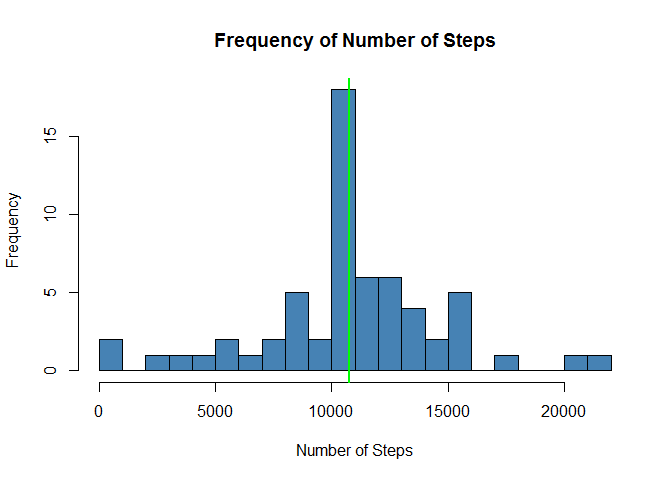

# Reproducible Research: Peer Assessment 1
Michael Smart  

## Loading and preprocessing the data

Firstly, we unzip the data and read it into a data object named 'act'. We then update the date column to ensure the data is stored as Date objects for analysis later.


```r
unzip(zipfile="activity.zip")
act <- read.csv("activity.csv", na.strings = "NA")
act$date <- as.Date(as.character(act$date), "%Y-%m-%d")
```

## What is mean total number of steps taken per day?

Firstly we 'sum' aggregate our full 'act' data set by the date and remove NA's (note that a day with all NA's will equate to 0 steps for that date which is what we expect). Once the aggregate 'agg' data set is created we apply appropriate names to the data.

Lastly we calculate the mean and median of the steps from our data set.


```r
agg <- aggregate(act$steps, by = act["date"], FUN = sum, na.rm = TRUE)
names(agg) <- c("date", "steps")
mean_steps <- round(mean(agg$steps), 0)
median_steps <- round(median(agg$steps), 0)
```

The following Histogram shows the number of times, i.e. the frequency, that our subject has achieved each bucket (broken into 20 buckets) of number of steps. On this we also plot the mean, indicated with a red line, and the median, idicateed with a green line.


```r
hist(agg$steps, 
     col="steelblue", 
     breaks = 20, 
     xlab = "Number of Steps", 
     ylab = "Frequency", 
     main = "Frequency of Number of Steps")

abline(v=mean_steps, col = "red", lwd = 2)
abline(v=median_steps, col = "green", lwd = 2)
```

<!-- -->

```r
mean_steps
```

```
## [1] 9354
```

```r
median_steps
```

```
## [1] 10395
```

For interest we can also plot, with a barplot, the actual number of steps taken per day, again showing the mean (red line) and median (green line) values.


```r
barplot(agg$steps, 
        names.arg = agg$date, 
        col = "steelblue", 
        xlab = "Date", 
        ylab = "Number of Steps Taken", 
        main = "Number of Steps taken per Day")

abline(h=mean_steps, col = "red", lwd = 2)
abline(h=median_steps, col = "green", lwd = 2)
```

<!-- -->

## What is the average daily activity pattern?

Next we aggregate our full 'act' data set by each interval calculating the mean/average steps taken per interval, again we remove the NA values and also name our columns of the new agg data object. 


```r
agg <- aggregate(act$steps, by = act["interval"], FUN = mean, na.rm = TRUE)
names(agg) <- c("interval", "avesteps")
```

The graph below shows the average daily steps pattern of our subject.


```r
plot(agg$avesteps~agg$interval, 
     type="l", 
     lwd = 2, 
     col = "steelblue", 
     xlab = "Time Interval", 
     ylab = "Average Number of Steps", 
     main = "Average Number of Steps by Time Interval")
```

<!-- -->

```r
toptime <- subset(agg, agg$avesteps == max(agg$avesteps))
```

The highest average number of steps is 206.1698113 and occurs at the 835th interval. 

## Imputing missing values

As the research so far has eluded to, we have missing data (NA's) in our full 'act' data set.


```r
total_nas <- nrow(act[(is.na(act$steps)),])
```

We have a total of `r total_nas' in our full 'act' data set.

Our strategy to replace these NA's is to calculate the mean value for each time interval (which we have done previously and stored in the 'agg' data object) and replace the NA's with the calculated mean.

By looking at the first few rows of the 'act' data object and the 'agg' data object, we can see that NA exists on the first row of the 'act' object. As this occurs at interval 0, we will replace this NA with the average steps during this time period, which is 1.7169811.


```r
head(act)
```

```
##   steps       date interval
## 1    NA 2012-10-01        0
## 2    NA 2012-10-01        5
## 3    NA 2012-10-01       10
## 4    NA 2012-10-01       15
## 5    NA 2012-10-01       20
## 6    NA 2012-10-01       25
```

```r
head(agg)
```

```
##   interval  avesteps
## 1        0 1.7169811
## 2        5 0.3396226
## 3       10 0.1320755
## 4       15 0.1509434
## 5       20 0.0754717
## 6       25 2.0943396
```

The following code creates a new data object 'fact' so that we leave our raw 'act' data alone. It then loops the rows and if the steps value is NA then this is replaced with the mean for that time interval.


```r
fact <- act
for(x in 1:nrow(fact)){
  if(is.na(fact[x,]$steps)){
    fact[x,]$steps <- agg[agg$interval==fact[x,]$interval,]$avesteps
  }
}
head(fact)
```

```
##       steps       date interval
## 1 1.7169811 2012-10-01        0
## 2 0.3396226 2012-10-01        5
## 3 0.1320755 2012-10-01       10
## 4 0.1509434 2012-10-01       15
## 5 0.0754717 2012-10-01       20
## 6 2.0943396 2012-10-01       25
```

As we can see from the first few rows of our 'fact' data object (shown above) for interval 0 on 2012-10-01 we have now replaced NA with the value 1.7169811.

If we now recreate the 'Frequency of Number of Steps' and 'Number of Steps taken per Day' plots, we can see the difference replacing the NA's has had.


```r
agg <- aggregate(fact$steps, by = fact["date"], FUN = sum, na.rm = TRUE)
names(agg) <- c("date", "steps")
new_mean_steps <- round(mean(agg$steps), 0)
new_median_steps <- round(median(agg$steps), 0)

new_mean_steps
```

```
## [1] 10766
```

```r
new_median_steps
```

```
## [1] 10766
```

```r
hist(agg$steps, 
     col="steelblue", 
     breaks = 20, 
     xlab = "Number of Steps", 
     ylab = "Frequency", 
     main = "Frequency of Number of Steps")

abline(v=new_mean_steps, col = "red", lwd = 2)
abline(v=new_median_steps, col = "green", lwd = 2)
```

<!-- -->

```r
barplot(agg$steps, 
        names.arg = agg$date, 
        col = "steelblue", 
        xlab = "Date", 
        ylab = "Number of Steps Taken", 
        main = "Number of Steps taken per Day")

abline(h=new_mean_steps, col = "red", lwd = 2)
abline(h=new_median_steps, col = "green", lwd = 2)
```

<!-- -->

The new mean value is now identical to the new median value, for this reason we can only see the green 'median' line on the graph (as the mean line was plotted first and overwritten by the green line). We can see that using our strategy of replacing NA's with the mean for that time interval it has had a large effect, however we still see days where the number of steps is very low (<200), shown in the table below. It may be worth discussing these outliers with the subject as the true number of steps may not have been recorded correctly.


```r
subset(agg,agg$steps<200)
```

```
##          date steps
## 2  2012-10-02   126
## 46 2012-11-15    41
```

## Are there differences in activity patterns between weekdays and weekends?

First lets create a function that takes a string, if that string is either 'Saturday' or 'Sunday' then 'weekend' is returned, otherwise 'weekday'. We then add a new column to our complete (no NAs) data object 'fact' for the weekday, then the daytype is calculated using our function.

Finally we aggregate our data by the daytype (Weekday or Weekend) and by the time interval.


```r
getDayType <- function(x){
  if(x %in% c("Saturday","Sunday")){
    return("weekend")
  }
  else{
    return("weekday")
  }
}

fact$dayname <- weekdays(fact$date)
fact$daytype <- apply(as.matrix(fact$dayname), 1, getDayType)
fact$daytype <- as.factor(fact$daytype)

agg <- aggregate(fact$steps~fact$daytype+fact$interval, FUN = mean)
names(agg) <- c("daytype", "interval", "steps")
```

Finally we can plot the weekend vs weekday average steps per time interval.


```r
library(lattice)
xyplot(steps~interval | daytype, data = agg,
      type = "l",
      xlab = "Time Interval",
      ylab = "Average Number of Steps",
      col = "steelblue",
      main = "Average Number Steps by Time Interval\nsplit by Weekday/Weekend",
      layout = c(1,2))
```

<!-- -->

